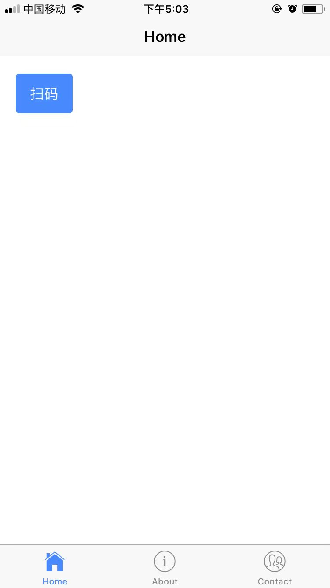
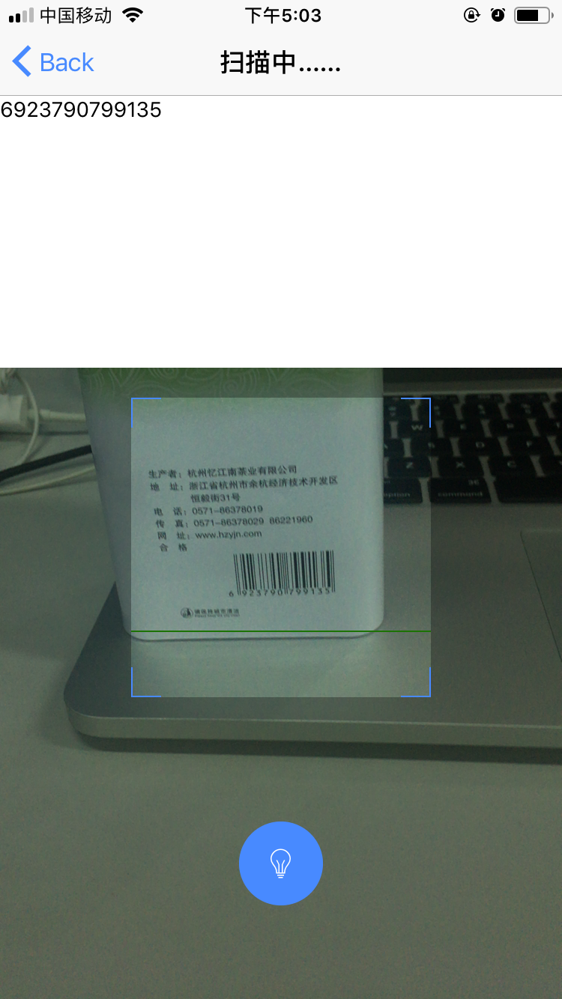

#ionic-tabs

## 效果

## 安装Ionic v3

* npm install -g ionic@3.20.1
* ionic -version 查看版本号

## 安装Cordova

* npm install -g cordova
* cordova -version 查看版本号

## 安装包

* npm i
* ionic cordova plugin add _plugins/cordova-plugin-qrscanner

## Homebrew is “the missing package manager for macOS”.

* 安装前请看https://gradle.org/install/#with-a-package-manager
* brew install gradle

## 创建项目

* ionic start 项目名称 模板名称  模板名称：tabs、sidemenu、blank、super、tutorial

## 在浏览器中运行

* ionic serve

## Navigation

Navigation控制App内不同的页面间进行转换。Ionic的Navigation遵循各原生平台的导航原则。Navigation是在ion-nav组件内进行处理的，像一个简单的栈，页面被push或被pop，就可以实现向前导航或历史栈的后退导航。

## 主题化

Ionic App支持主题风格。要改变主题，只需要调整src/theme/variables.scss文件中的$colors

## plugin 安装 https://cordova.apache.org/plugins/

安装cordova插件的时候用ionic cordova plugin add ...的方式添加，这样会在package.json中添加这个插件的条目，如果有人clone了你的项目想在本地运行，可以用ionic state restore它会根据cordovaPlugins条目安装对应的插件。如果直接用cordova plugin add 安装则不会更新package.json。
删除用 ionic cordova plugin remove

## 兼容android4.0

* cordova-plugin-crosswalk-webview

## platform 平台

* ionic cordova platform add android
* ionic cordova platform add ios

## 移除平台

* ionic cordova platform remove android
* ionic cordova platform remove ios

## emulate 将Ionic项目部署到模拟器或仿真器上

emulate命令将App部署到特定的平台设备上。你也可以通过在特定的模拟器上添加--livereload选项运行live reload。live reload功能类似ionic serve，但是不是使用标准的浏览器来开发和调试，编译后的hybrid应用本身会监控任何文件改变并在需要的时候重新载入App。这降低了针对小改动需要频繁重新编译App的需求。然而任何插件的改变将导致完全的重新编译。为使live reload能够正常工作，开发机和模拟器必须在一个相同的本地网络中，并且设备必须支持web sockets。
* cordova run ios --list
* cordova run android --list
* ionic cordova emulate android -l -c
* iionic cordova emulate ios -l -c -- --buildFlag="-UseModernBuildSystem=0"

## run 在连接的设备上运行Ionic项目

run命令将应用部署到指定的设备上。你可以通过添加--livereload选项在指定的平台设备上运行live reload。live reload功能类似ionic serve，但是不是使用标准的浏览器来开发和调试，编译后的hybrid应用本身会监控任何文件改变并在需要的时候重新载入App。这降低了针对小改动需要频繁重新编译App的需求。然而任何插件的改变将导致完全的重新编译。为使live reload能够正常工作，开发机和模拟器必须在一个相同的本地网络中，并且设备必须支持web sockets。

* ionic cordova run android -l -c
* ionic cordova run ios -l -c -- --buildFlag="-UseModernBuildSystem=0"

## 制作签名文件(.keystore文件)

keytool -genkey -v -keystore my-release-key.jks -keyalg RSA -keysize 2048 -validity 10000 -alias my-alias

## build

* 打包debug调试版（生成的apk就是debug调试版本） ionic cordova build android --prod
* 打包release发布版（release版本是必须有签名才能在手机上运行） ionic cordova build android --prod --release --buildConfig
* sudo cp Downloads/PackageApplication /Applications/Xcode.app/Contents/Developer/Platforms/iPhoneOS.platform/Developer/usr/bin
* ionic cordova build ios --buildConfig --prod --device

## info

* ionic info 列出用户的Ionic运行环境信息

## 远程调试——VS Code插件

VS Code有一个专用的插件(Cordova Tools)来调试Cordova程序。这个插件在设备和调试器直接建立桥接，允许你在编辑器中直接设置断点。

## 远程调试——Android和Chrome

Chrome DevTools开发者工具是调试应用的有力工具。当你使用ionic serve命令在浏览器中运行应用的时候，DevTools可以用来检查元素，查看console日志，分析应用或其他更多功能。
DevTools除了可以在浏览器中调试应用，还可以用来远程调试物理设备甚至Genymotion模拟器中的应用。首先，我们需要安装adb。安装后一旦设备连接上，或Android模拟器运行起来的时候，你可以运行下面的命令来查看设备列表：
$ adb devices
然后在Chrome中打开chrome://inspect/#devices来查看Android设备。注意，也许需要改变设备的设置来允许USB调试。注意你可以使用Chrome来调试应用，就像在浏览器中那样！

## Using ngx-translate

* https://ionicframework.com/docs/developer-resources/ng2-translate/
* https://github.com/ngx-translate/core

## 使用typings

* typings search echarts
* typings install dt~echarts --global --save

## ionic3 css-utilities

* http://ionicframework.com/docs/theming/css-utilities/

# 命令行工具自动修改应用图标及添加启动画面

1. 在项目的根目录下创建resources文件夹。
2. 在文件夹中都放入icon.png（应用图标，最小1024×1024px，不带圆角），splash.png（启动屏幕，最小2732×2732px，中间区域1200x1200px）(可以是
    png、psd、ai)
3. 在cmd中进入项目所在文件夹执行：ionic cordova resources .执行该命令后，会自动在resources文件夹下创建已添加的平台名称的文件夹，如：android，其
    中会自动将图片进行缩放、裁剪，生成不同分辨率的图片，并在config.xml中添加相应内容。

    也可分开执行：
    * ionic cordova resources --icon， -i 生成图标资源
    * ionic cordova resources --splash， -s 生成启动画面资源
    * ionic cordova resources --force， -f 强制资源再生
4. 要禁用此功能并始终覆盖生成的图像，请使用--force

# 生命周期

* ionViewLoaded 页面加载完毕触发。该事件发生在页面被创建成 DOM 的时候，且仅仅执行一次。如果页面被缓存（Ionic默认是缓存的）就不会再次触发该事件。该事件中可以放置初始化页面的一些事件。
* ionViewWillEnter 即将进入一个页面变成当前激活页面的时候执行的事件。
* ionViewDidEnter 进入了一个页面且变成了当前的激活页面，该事件不管是第一次进入还是缓存后进入都将执行。
* ionViewWillLeave 将要离开了该页面之后变成了不是当前激活页面的时候执行的事件。
* ionViewDidLeave 在页面完成了离开该页面并变成了不是当前激活页面的时候执行的事件。
* ionViewWillUnload 在页面销毁和页面中有元素移除之前执行的事件。
* ionViewDidUnload 在页面销毁和页面中有元素移除之后执行的事件。

# UIActivityViewController

* 方式	字符串常量	字符串内容
* AirDrop	UIActivityTypeAirDrop	com.apple.UIKit.activity.AirDrop
* SMS	UIActivityTypeMessage	com.apple.UIKit.activity.Message
* Mail	UIActivityTypeMail	com.apple.UIKit.activity.Mail
* 备忘录	N/A	com.apple.mobilenotes.SharingExtension
* 新浪微博	UIActivityTypePostToWeibo	com.apple.UIKit.activity.PostToWeibo
* iBooks	UIActivityTypeOpenInIBooks	com.apple.UIKit.activity.OpenInIBooks
* QQ	N/A	com.tencent.mqq.ShareExtension
* 微信	N/A	com.tencent.xin.sharetimeline
* Twitter	UIActivityTypePostToTwitter	com.apple.UIKit.activity.PostToTwitter
* Facebook	UIActivityTypePostToFacebook	com.apple.UIKit.activity.PostToFacebook
* Flicker	UIActivityTypePostToFlickr	com.apple.UIKit.activity.PostToFlickr
* Vimeo	UIActivityTypePostToVimeo	com.apple.UIKit.activity.PostToVimeo
* 腾讯微博	UIActivityTypePostToTencentWeibo	com.apple.UIKit.activity.TencentWeibo
* 提醒事项	N/A	com.apple.reminders.RemindersEditorExtension
* 保存到相册	UIActivityTypeSaveToCameraRoll	com.apple.UIKit.activity.SaveToCameraRoll
* 指定到联系人	UIActivityTypeAssignToContact	com.apple.UIKit.activity.AssignToContact
* 复制到剪贴板	UIActivityTypeCopyToPasteboard	com.apple.UIKit.activity.CopyToPasteboard
* 打印	UIActivityTypePrint	com.apple.UIKit.activity.Print
* 添加到阅读列表	UIActivityTypeAddToReadingList	com.apple.UIKit.activity.AddToReadingList

# ios phonegap-plugin-push

* build失败并显示错误：“ld：找不到-lGoogleToolboxForMac的库”
https://ionic.zendesk.com/hc/en-us/articles/360000170008?input_string=googletoolboxformac+library+not+found
* 使用 v1 api https://firebase.google.com/docs/cloud-messaging/migrate-v1
* 如果 config.xml 加上<resource-file src="GoogleService-Info.plist" /> ios 的 registrationType = FCM,发送消息要加上 content_available = true firebase才使用APNS推送消息。
* 如果 config.xml 不加上<resource-file src="GoogleService-Info.plist" /> ios 的 registrationType = APNS, 会正常接收APNS推送消息。
